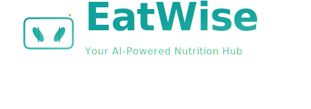

# EatWise Branding Guidelines

## Table of Contents
1. [Brand Overview](#brand-overview)
2. [Logo System](#logo-system)
3. [Color Palette](#color-palette)
4. [Typography](#typography)
5. [Voice & Tone](#voice--tone)
6. [Visual Style](#visual-style)
7. [Application Guidelines](#application-guidelines)
8. [Do's & Don'ts](#dos--donts)

---

## Brand Overview

### Mission
EatWise empowers individuals to understand and optimize their nutrition through intelligent meal tracking and AI-powered insights.

### Vision
Make healthy eating accessible, intuitive, and scientifically-backed for everyone.

### Brand Values
- **Intelligence** - AI-driven insights, data-focused
- **Wellness** - Health-first approach, positive psychology
- **Simplicity** - Intuitive interfaces, no jargon
- **Trust** - Accurate data, transparent science
- **Empowerment** - User control, personalization
- **Community** - Shared goals, mutual support

### Target Audience
- Health-conscious individuals (18-50 years old)
- Fitness enthusiasts and athletes
- People managing health conditions through nutrition
- Users seeking positive lifestyle change
- Tech-savvy wellness seekers

---

## Logo System

### Primary Logo (Full Horizontal)
**File:** `eatwise-logo-full-horizontal.svg`  
**Use:** Website header, marketing materials, landing pages, presentations  
**Minimum Width:** 200px  
**Clear Space:** 20px minimum on all sides  

```
[Logo Mark] EatWise
           Your AI-Powered Nutrition Hub
```

### Secondary Logo (Stacked)
**File:** `eatwise-logo-stacked.svg`  
**Use:** App sidebar, mobile headers, vertical spaces, social profiles  
**Minimum Width:** 100px  
**Clear Space:** 15px minimum on all sides  

```
       [Logo Mark]
        EatWise
Your AI-Powered Nutrition Hub
```

### Logo Mark (Icon Only)
**File:** `eatwise-icon.svg`  
**Use:** Favicon, app icon, badges, small UI elements, avatars  
**Sizes:** 16px, 32px, 64px, 128px, 256px, 512px  
**Minimum Size:** 16px (should remain recognizable)

### Logo Variations

#### Monochrome - Black
**File:** `eatwise-icon-monochrome-black.svg`  
**Use:** Print materials, black and white documents, embroidery  
**Background:** Light or white backgrounds

#### Monochrome - White
**File:** `eatwise-icon-monochrome-white.svg`  
**Use:** Dark backgrounds, inverse printing, dark mode  
**Background:** Dark or colored backgrounds

#### Outlined Version
**File:** `eatwise-icon-outlined.svg`  
**Use:** Line icon sets, minimal backgrounds, light interfaces  
**Stroke Width:** 2px minimum for legibility

### Logo Anatomy
The EatWise logo combines three key elements:
1. **Bowl** - Container for nourishment, holding nutritional value
2. **Leaves** - Natural, healthy, growth-oriented
3. **Fork** - Action, eating, consumption
4. **Sparkle** - AI element, intelligence, technology

Each element works together to communicate: "AI-powered health tracking through nutrition."

### Logo Don'ts

❌ **Never:**
- Stretch or distort the logo
- Change colors without authorization
- Add drop shadows or effects
- Use the logo smaller than 16px
- Rotate the logo (except as full icon)
- Combine with other logos
- Place on colors with insufficient contrast
- Outline or border the logo
- Use outdated versions

---

## Color Palette

### Primary Colors

#### Primary Teal - "Trust & Health"
- **Hex:** `#10A19D`
- **RGB:** 16, 161, 157
- **CMYK:** 90, 0, 7, 37
- **Usage:** Main brand color, primary calls-to-action, primary text, key UI elements

#### Light Teal - "Energy & Growth"
- **Hex:** `#52C4B8`
- **RGB:** 82, 196, 184
- **CMYK:** 58, 0, 6, 23
- **Usage:** Accents, highlights, hover states, secondary elements

#### Coral - "Action & Motivation"
- **Hex:** `#FF6B6B`
- **RGB:** 255, 107, 107
- **CMYK:** 0, 58, 58, 0
- **Usage:** Calls-to-action, alerts, important notifications, badges

### Secondary Colors

#### Success Green - "Achievement"
- **Hex:** `#51CF66`
- **RGB:** 81, 207, 102
- **CMYK:** 61, 0, 51, 19
- **Usage:** Success states, achievements, badges, progress completion

#### Warning Yellow - "Attention"
- **Hex:** `#FFD43B`
- **RGB:** 255, 212, 59
- **CMYK:** 0, 17, 77, 0
- **Usage:** Caution, warnings, alerts, progress bars

#### Dark Navy - "Foundation"
- **Hex:** `#0a0e27`
- **RGB:** 10, 14, 39
- **CMYK:** 74, 64, 0, 85
- **Usage:** Backgrounds, dark mode, text contrast

#### Light Text - "Readability"
- **Hex:** `#e0f2f1`
- **RGB:** 224, 242, 241
- **CMYK:** 7, 0, 1, 5
- **Usage:** Light mode text, high contrast text

### Color Usage in Contexts

**Health & Wellness:**
- Primary: Green (#51CF66) for healthy/positive states
- Secondary: Yellow (#FFD43B) for moderation needed
- Alert: Coral (#FF6B6B) for warnings/excess

**Technology/AI Elements:**
- Primary: Teal (#10A19D) for intelligence
- Accent: Coral (#FF6B6B) for automation/action
- Support: Light Teal (#52C4B8) for subtle indicators

**Progress & Motivation:**
- Fill: Teal gradient (Primary → Light Teal)
- Accent: Coral for streaks/achievements
- Background: Subtle teal wash for context

### Accessibility Compliance
All primary colors maintain WCAG AA contrast ratios:
- Teal text on white: 5.8:1 (AAA)
- Coral text on white: 4.2:1 (AA)
- White text on Teal: 7.2:1 (AAA)
- Green text on white: 3.5:1 (AA)

---

## Typography

### Primary Font: Outfit

**Font Family:** Outfit (Google Fonts)  
**Fallback Stack:** `-apple-system, BlinkMacSystemFont, 'Segoe UI', Roboto, sans-serif`  
**Link:** [Google Fonts - Outfit](https://fonts.google.com/specimen/Outfit)

**Weights Used:**
- **400** Regular - Body text, descriptions
- **500** Medium - Labels, secondary headings
- **600** SemiBold - Section headers
- **700** Bold - Emphasis, highlights
- **800** ExtraBold - Logo, H1 headings
- **900** Black - Hero text, banners

### Typography Scale

| Usage | Size | Weight | Line Height | Letter Spacing |
|-------|------|--------|-------------|----------------|
| **Hero Heading** | 48-64px | 800-900 | 1.1 | -1 to 0 |
| **Page Title (H1)** | 32-40px | 800 | 1.2 | -0.5 |
| **Section Header (H2)** | 24-28px | 700 | 1.3 | -0.2 |
| **Subsection (H3)** | 18-20px | 600 | 1.4 | 0 |
| **Body Text** | 14-16px | 400 | 1.5 | 0.5 |
| **Small Text** | 12-14px | 400 | 1.4 | 0.5 |
| **Captions** | 11-12px | 500 | 1.3 | 0.5 |
| **Button Text** | 14-16px | 600 | 1.2 | 0.5 |

### Typography Examples

**Hero Heading:**
```
EatWise
Your AI-Powered Nutrition Hub
```
Font: Outfit ExtraBold 64px, Teal (#10A19D)

**Section Header:**
```
🍽️ Today's Meals
```
Font: Outfit Bold 24px, Light Text (#e0f2f1)

**Body Copy:**
```
Log your meals and get instant nutritional insights powered by AI. Track calories, macros, and micronutrients to achieve your health goals.
```
Font: Outfit Regular 14px, Light Text (#e0f2f1)

---

## Voice & Tone

### Brand Voice Characteristics
- **Friendly** - Approachable, not clinical
- **Motivating** - Encouraging, positive reinforcement
- **Clear** - Simple, jargon-free language
- **Intelligent** - Evidence-based, science-backed
- **Empowering** - User-focused, respectful

### Tone Variations by Context

#### Achievement/Positive Feedback
*Tone: Celebratory, enthusiastic*
- "🔥 Amazing! You've hit a 7-day streak!"
- "🎉 Daily goal achieved! Great work!"
- "✅ You're on track to your goals!"

#### Motivation/Gentle Nudges
*Tone: Encouraging, supportive*
- "💪 Great progress! Let's keep the momentum going."
- "📝 Don't forget to log your meals today!"
- "💡 Here's a tip for better nutrition..."

#### Alerts/Cautions
*Tone: Informative, helpful, not judgmental*
- "⚠️ This meal exceeds your sodium target"
- "📊 Your sugar intake is higher than usual"
- "💡 Consider: swapping this with a healthier option"

#### Instructions/Help
*Tone: Clear, step-by-step, supportive*
- "Take a photo of your meal or describe it in text"
- "Select the meal type from the options below"
- "Your nutrition analysis will appear in seconds"

### Language Guidelines

**Do:**
- ✅ Use "you" and "your" (personal, engaging)
- ✅ Use positive framing ("Increase protein" vs "Decrease carbs")
- ✅ Celebrate small wins and progress
- ✅ Explain the "why" behind recommendations
- ✅ Use emojis appropriately (one per message max)
- ✅ Break complex info into digestible chunks

**Don't:**
- ❌ Use medical/clinical jargon without explanation
- ❌ Be judgmental or shame-based ("You ate badly")
- ❌ Make promises you can't keep
- ❌ Use excessive exclamation marks (!!!)
- ❌ Overcomplicate simple messages
- ❌ Ignore accessibility (describe emojis)

### Example Messages

**Onboarding:**
"Welcome to EatWise! Let's get to know your nutrition goals. Start by telling us about yourself."

**Feature Introduction:**
"💡 **New Feature:** Photo meal logging. Take a photo and we'll analyze the nutrition instantly."

**Encouragement:**
"You're doing great! The fact that you're tracking means you're already on the path to better health."

**Gentle Nudge:**
"Haven't logged a meal today? No worries—it's never too late to start tracking!"

---

## Visual Style

### Design Principles

1. **Minimalist** - Clean interfaces, essential elements only
2. **Geometric** - Use of shapes, grids, and structured layouts
3. **Modern** - Contemporary aesthetics, smooth transitions
4. **Accessible** - High contrast, readable fonts, clear hierarchy
5. **Consistent** - Uniform spacing, sizing, and styling

### Component Style

#### Cards & Containers
- **Corners:** 12px border radius minimum
- **Shadows:** Subtle, 0 4px 12px rgba(0,0,0,0.1)
- **Background:** Transparent with 5-10% color overlay
- **Border:** 1-2px solid with color palette colors

#### Buttons
- **Style:** Gradient background, rounded corners (12px)
- **States:**
  - **Default:** Primary gradient, full opacity
  - **Hover:** Slight elevation, increased shadow
  - **Active:** Darker gradient, scale 0.98
  - **Disabled:** 60% opacity, no cursor change

#### Icons
- **Size Ranges:** 16px, 24px, 32px, 48px, 64px
- **Stroke Width:** 2-3px for outlined icons
- **Style:** Simple, geometric, consistent weight

#### Progress Bars
- **Background:** Subtle color, 10% opacity
- **Fill:** Color gradient (Primary → Light Teal)
- **Height:** 6-8px for thin bars, 12-16px for prominent
- **Animation:** Smooth 0.3s transition

### Animation & Motion

**Principles:**
- Purpose-driven (not decorative)
- Quick (200-400ms for UI elements)
- Smooth (cubic-bezier easing)
- Accessible (respects prefers-reduced-motion)

**Common Transitions:**
- **Hover States:** 200ms ease
- **Page Transitions:** 300ms fade-in
- **Loading:** 1.5s infinite shimmer
- **Success Feedback:** 400ms scale bounce

### Layout & Spacing

**Base Unit:** 8px  
**Spacing Scale:**
- Extra Small: 4px
- Small: 8px
- Medium: 16px
- Large: 24px
- Extra Large: 32px
- Section: 48px+

**Responsive Breakpoints:**
- Mobile: < 640px
- Tablet: 640px - 1024px
- Desktop: > 1024px

---

## Application Guidelines

### Logo Implementation in App

#### 1. Browser Favicon
```python
st.set_page_config(
    page_icon="assets/eatwise-icon.svg",  # Or PNG 32x32
)
```

#### 2. Login Page Hero
```html

```

#### 3. App Header/Sidebar
```python
col1, col2 = st.columns([0.2, 1])
with col1:
    st.image("assets/eatwise-icon.svg", width=40)
with col2:
    st.markdown("## EatWise")
```

#### 4. Achievement Badges
```python
st.image("assets/eatwise-icon.svg", width=64)
st.caption("💪 Consistency Champion")
```

#### 5. Page Backgrounds
Use subtle teal gradient:
```css
background: linear-gradient(135deg, #0a0e27 0%, #1a1f3a 25%, 
                           #0D7A76 75%, #063d3a 100%);
```

### Color Implementation in App

**Primary Actions:**
```python
st.button("Log Meal", key="log_btn")  # Uses primary teal
```

**Status Indicators:**
```python
# Success
st.success("✅ Meal logged successfully!")  # Green #51CF66

# Warning
st.warning("⚠️ Sodium intake high today")  # Yellow #FFD43B

# Info
st.info("💡 AI insight: Try more protein")  # Teal #10A19D
```

**Data Visualization:**
```python
colors = {
    "Protein": "#51CF66",    # Green - good to exceed
    "Carbs": "#FFD43B",      # Yellow - monitor
    "Fat": "#FF6B6B",        # Coral - track carefully
    "Sodium": "#FF6B6B"      # Coral - reduce
}
```

### Typography Implementation in App

**CSS Font Import:**
```html
<link href="https://fonts.googleapis.com/css2?family=Outfit:wght@400;500;600;700;800&display=swap" 
      rel="stylesheet">
```

**CSS Application:**
```css
html, body, [class*="css"] {
    font-family: 'Outfit', -apple-system, BlinkMacSystemFont, 'Segoe UI', sans-serif;
}
```

**Markdown Styling:**
```markdown
# Hero Heading (H1) - 64px, Bold
## Section Header (H2) - 32px, Bold
### Subsection (H3) - 24px, SemiBold

**Bold text** - 600 weight
*Italic text* - for emphasis

Regular body text flows naturally at 14px with 1.5 line height.
```

---

## Do's & Don'ts

### Logo Do's ✅
- ✅ Maintain proper clear space (20px minimum)
- ✅ Use provided SVG files (highest quality)
- ✅ Scale proportionally
- ✅ Ensure sufficient contrast against backgrounds
- ✅ Use color variations for different backgrounds
- ✅ Place on solid or subtle backgrounds
- ✅ Test at multiple sizes before finalizing

### Logo Don'ts ❌
- ❌ Don't skew, stretch, or distort
- ❌ Don't add effects (shadows, glows, 3D)
- ❌ Don't rotate at odd angles
- ❌ Don't use below 16px
- ❌ Don't add borders or outlines
- ❌ Don't combine with other logos
- ❌ Don't change colors arbitrarily
- ❌ Don't place on busy backgrounds

### Color Do's ✅
- ✅ Use primary teal for main actions and trust elements
- ✅ Use coral for attention-grabbing CTAs
- ✅ Use green for positive feedback and achievements
- ✅ Use yellow for cautions and warnings
- ✅ Maintain sufficient contrast for accessibility
- ✅ Test colors on actual backgrounds
- ✅ Use gradients for visual interest (primary to light teal)

### Color Don'ts ❌
- ❌ Don't mix too many colors (stick to palette)
- ❌ Don't use colors only for meaning (add icons/labels)
- ❌ Don't reduce contrast below WCAG AA standards
- ❌ Don't use coral for large text areas (hard on eyes)
- ❌ Don't invent new colors that "match"
- ❌ Don't use full saturation yellow for backgrounds
- ❌ Don't forget about color blindness

### Typography Do's ✅
- ✅ Use Outfit for all brand materials
- ✅ Match the tone to the context
- ✅ Use clear hierarchy (sizes, weights)
- ✅ Break up long text into chunks
- ✅ Use meaningful emoji (max 1 per message)
- ✅ Be consistent with formatting
- ✅ Proofread for accuracy

### Typography Don'ts ❌
- ❌ Don't mix multiple font families
- ❌ Don't use ALL CAPS for body text
- ❌ Don't make fonts smaller than 12px
- ❌ Don't use italic for body text
- ❌ Don't forget line height (minimum 1.4)
- ❌ Don't use jargon without explanation
- ❌ Don't overuse exclamation marks

### Voice & Tone Do's ✅
- ✅ Be friendly and approachable
- ✅ Celebrate user achievements
- ✅ Explain the reasoning
- ✅ Use "you" and "your"
- ✅ Provide actionable suggestions
- ✅ Be positive and motivating
- ✅ Respect user intelligence

### Voice & Tone Don'ts ❌
- ❌ Don't be clinical or robotic
- ❌ Don't shame or judge users
- ❌ Don't use complex jargon
- ❌ Don't make false promises
- ❌ Don't be overly casual
- ❌ Don't ignore edge cases
- ❌ Don't overwhelm with information

---

## Files & Assets

### Logo Files Location
```
assets/
├── eatwise-logo-full-horizontal.svg    # Primary logo + text
├── eatwise-logo-stacked.svg             # Vertical logo + text
├── eatwise-icon.svg                     # Icon with gradient
├── eatwise-icon-monochrome-black.svg    # Black version
├── eatwise-icon-monochrome-white.svg    # White version
└── eatwise-icon-outlined.svg            # Line art version
```

### File Naming Convention
```
eatwise-[type]-[variant].svg

Types: logo, icon
Variants: full-horizontal, stacked, monochrome-black, monochrome-white, outlined
```

### Export Specifications

**For SVG:**
- Remove unnecessary metadata
- Optimize paths (remove redundant points)
- Convert text to paths
- File size target: < 50KB

**For PNG:**
- Resolution: 256px minimum for web
- Background: Transparent (PNG-24)
- DPI: 72 for screen, 300 for print
- Format: PNG-8 (if solid colors) or PNG-24

---

## Version History

| Version | Date | Changes |
|---------|------|---------|
| 1.0 | November 2025 | Initial brand guidelines creation |

---

## Contact & Support

**For branding questions:**
- Review this guide first
- Check design consistency
- Compare against brand values

**For updates to guidelines:**
- Document all changes with date
- Update version number
- Notify all team members

---

*EatWise Branding Guidelines v1.0*  
*Created: November 2025*  
*Last Updated: November 2025*

---

## Quick Reference Card

### Colors at a Glance
```
Primary Teal:    #10A19D  (Trust, Health, Main)
Light Teal:      #52C4B8  (Energy, Accent)
Coral:           #FF6B6B  (Action, CTA)
Green:           #51CF66  (Success, Achievement)
Yellow:          #FFD43B  (Warning, Caution)
Dark Navy:       #0a0e27  (Background)
Light Text:      #e0f2f1  (Readability)
```

### Typography
```
Font: Outfit
Heading: 800 weight, -1 letter-spacing
Body: 400 weight, 0.5 letter-spacing
Buttons: 600 weight, 0.5 letter-spacing
```

### Logo Rules
```
✓ Use SVG files
✓ Min 20px clear space
✓ Min 16px size
✓ Maintain proportions
✗ No effects, rotation, or distortion
```

### Voice Principles
```
✓ Friendly & encouraging
✓ Clear & simple
✓ Evidence-based
✓ User-focused
✗ No clinical jargon
✗ No judgment or shame
```

---

**End of Branding Guidelines**
