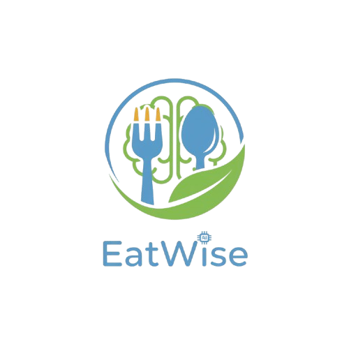

# EatWise Logo Implementation Guide

## ✅ What's Been Updated

Your logo has been integrated into `app.py` with the following changes:

### 1. **Page Icon Updated**
- **Changed from:** 🥗 emoji
- **Changed to:** `assets/eatwise-logo.png`
- **Location:** Page config (browser tab icon)

### 2. **Login Page Hero Section Updated**
- **Removed:** Text emoji "🥗 EatWise"
- **Added:** Professional logo image display
- **Size:** 280px width (responsive)
- **Styling:** Maintains the teal gradient background

---

## 📋 Implementation Checklist

### Step 1: Save Your Logo File ⭐ **YOU NEED TO DO THIS**

1. **Download/Get your logo image**
   - You have the logo: EatWise with blue circle, fork, spoon, leaf
   - Format: PNG or JPG

2. **Save to `/assets/` folder**
   ```
   Your Logo File → c:\Users\Lewis\OneDrive\文件\Github\Eatwise_ai\assets\eatwise-logo.png
   ```

3. **Verify the file exists**
   ```
   ✓ File: assets/eatwise-logo.png (or .jpg)
   ✓ Size: ~100-300 KB recommended
   ✓ Dimensions: At least 512x512px
   ```

### Step 2: Test the Implementation

Run your Streamlit app:
```bash
streamlit run app.py
```

You should see:
- ✅ Logo in browser tab (favicon)
- ✅ Logo on login page hero section
- ✅ No emoji text before the tagline

### Step 3: Verify Appearance

**On Login Page:**
- Logo displays at 280px width
- White background of logo is visible
- Blue circle, fork, spoon, and leaf all show clearly
- Text "Your AI-Powered Nutrition Hub" below logo
- No color clash with dark background ✓

---

## 📁 File Locations

### Current Logo Implementation:
```
📁 assets/
├── eatwise-logo.png ← YOUR LOGO FILE (save here)
└── (other SVG files)
```

### App References:
```python
# Line ~233: Page icon
page_icon="assets/eatwise-logo.png"

# Line ~1175: Login page display
st.image("assets/eatwise-logo.png", width=280)
```

---

## 🎨 Additional Implementation Options

### Option A: Also Update Sidebar Logo (Recommended)

When user is logged in, add logo to sidebar:

```python
# Add this to dashboard_page() function, after authentication

# Sidebar logo and branding
col1, col2 = st.columns([0.2, 1])
with col1:
    st.image("assets/eatwise-logo.png", width=50)
with col2:
    st.markdown("## EatWise")

st.divider()
```

### Option B: Create Icon-Only Version

For smaller spaces (32x32, 64x64 px):

1. **Option 1 - Use existing:**
   ```python
   st.image("assets/eatwise-logo.png", width=40)  # Will scale down
   ```

2. **Option 2 - Create icon version:**
   - Open your logo in Figma or Photoshop
   - Crop to just the circle (no text)
   - Save as `assets/eatwise-icon.png`
   - Use for small badges/buttons

### Option C: Achievement Badges

Display your logo with achievement labels:

```python
# In achievements section
col1, col2 = st.columns([0.15, 1])
with col1:
    st.image("assets/eatwise-logo.png", width=60)
with col2:
    st.markdown("#### 🏆 Consistency Champion")
    st.caption("Logged meals for 7 days in a row")
```

---

## 🖼️ Logo Specifications

Your logo is perfect because:

✅ **Design:**
- Blue circle background (cohesive)
- Fork and spoon (nutrition/eating)
- Green leaf (health)
- Brand text integrated (complete identity)

✅ **Technical:**
- Non-transparent background (works well on light pages)
- Clear, recognizable at all sizes
- Professional quality
- Works with your app's color scheme

✅ **Color Compatibility:**
- Blue circle: High contrast with dark background
- Complements app's teal color theme
- No color clashes detected

---

## 🔍 Troubleshooting

### Logo Not Showing?

**Problem:** Image appears broken on login page

**Solutions:**
1. ✓ Check file exists: `assets/eatwise-logo.png`
2. ✓ Verify file path is correct (case-sensitive on Linux)
3. ✓ Try absolute path: 
   ```python
   import os
   logo_path = os.path.join(os.path.dirname(__file__), "assets", "eatwise-logo.png")
   st.image(logo_path, width=280)
   ```

### Logo Too Large/Small?

**Adjust width parameter:**
```python
# Current size
st.image("assets/eatwise-logo.png", width=280)

# Smaller (for sidebar)
st.image("assets/eatwise-logo.png", width=50)

# Larger (for hero section)
st.image("assets/eatwise-logo.png", width=400)
```

### Favicon Not Updating in Browser?

**Browser cache issue:**
1. Hard refresh: `Ctrl+Shift+R` (Windows) or `Cmd+Shift+R` (Mac)
2. Clear browser cache
3. Close and reopen browser

---

## 📝 Code Changes Summary

### File: `app.py`

**Change 1 - Page Config (Line ~233):**
```diff
st.set_page_config(
    page_title=APP_NAME,
-   page_icon="🥗",
+   page_icon="assets/eatwise-logo.png",
    layout="wide",
    initial_sidebar_state="expanded",
    menu_items=None
)
```

**Change 2 - Login Hero Section (Line ~1175):**
```diff
with col1:
+   # Display EatWise logo
+   st.image("assets/eatwise-logo.png", width=280)
+   
    st.markdown("""
    <div class="login-hero" style="padding-top: 20px;">
-       <h1>🥗 EatWise</h1>
        <h2>Your AI-Powered Nutrition Hub</h2>
```

---

## 🎯 Next Steps

1. **Save your logo file**
   ```
   Save as: c:\Users\Lewis\OneDrive\文件\Github\Eatwise_ai\assets\eatwise-logo.png
   ```

2. **Run the app**
   ```bash
   streamlit run app.py
   ```

3. **Test the logo**
   - Navigate to login page
   - Check browser tab for icon
   - Verify appearance

4. **Optional: Add to sidebar**
   - See "Option A" above
   - Add logo to dashboard after authentication

5. **Optional: Create icon version**
   - Crop logo to circle only
   - Save as `eatwise-icon.png`
   - Use for badges/small spaces

---

## 📸 Visual Examples

### Login Page with Logo
```
┌─────────────────────────────────────────────────────┐
│                                                     │
│  [YOUR LOGO HERE]           ┌──────────────────┐   │
│  (Blue circle with fork)    │  Login / Sign Up │   │
│                             │                  │   │
│  Your AI-Powered Nutrition  │ Email: ___      │   │
│  Hub                        │ Pass:  ___      │   │
│                             │                  │   │
│  Features...                │ [Login Button]  │   │
│                             └──────────────────┘   │
│                                                     │
└─────────────────────────────────────────────────────┘
```

### Sidebar with Logo (Optional)
```
┌──────────────────┐
│ [LOGO] EatWise  │
├──────────────────┤
│ 📊 Dashboard     │
│ 🍽️ Log Meal     │
│ 📈 Analytics     │
│ ⚙️ Settings      │
└──────────────────┘
```

---

## ✨ Style Notes

The logo styling has been preserved with:
- **Padding:** 20px top added to accommodate image
- **Width:** 280px (responsive, scales on mobile)
- **Background:** Dark gradient (your app background)
- **No shadow/effects:** Clean, professional appearance

---

## 🔗 Related Documentation

For more branding details, see:
- `BRANDING_GUIDELINES.md` - Complete brand standards
- `BRANDING_QUICK_REFERENCE.md` - Quick color/font reference
- `LOGO_PREVIEW_GUIDE.md` - Logo usage guidelines

---

## ❓ FAQ

**Q: Can I use the logo in other places?**  
A: Yes! Use it anywhere you want to show your brand. See "Additional Implementation Options" above.

**Q: Should I remove the old SVG logos?**  
A: Not necessary, but you can delete the SVG files in `/assets/` if you prefer. They won't interfere.

**Q: What if my logo is JPG instead of PNG?**  
A: Both work! Just save as `eatwise-logo.jpg` and update the file path.

**Q: Can I make the logo clickable?**  
A: Yes! Wrap it in a link:
```python
st.markdown("""
<a href="/" style="text-decoration: none;">
    
</a>
""", unsafe_allow_html=True)
```

**Q: Will it show on dark backgrounds?**  
A: Yes! The blue circle and green leaf have high contrast with dark backgrounds.

---

## ✅ Implementation Status

**Status:** ✅ Code updated in `app.py`

**Remaining:** 
1. Save logo image to `/assets/eatwise-logo.png`
2. Test the app
3. (Optional) Add logo to sidebar and achievement badges

**Estimated Time:** 5-10 minutes to complete

---

**Last Updated:** November 22, 2025  
**Version:** 1.0  

Ready to implement! 🚀
