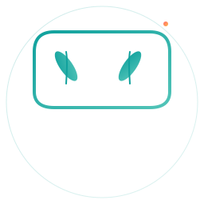
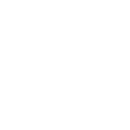

# EatWise Logo Preview & Implementation Guide

## 🎨 Logo Design Overview

The EatWise logo combines **4 symbolic elements** representing AI-powered nutrition:

```
┌─────────────────────────────────────────┐
│                                         │
│  [Bowl] ← Container for nourishment   │
│   /     \                               │
│  [Leaf]  [Leaf] ← Health, natural     │
│   |   \    /    |                      │
│   |    \  /     |                      │
│   |  [Fork] ← Action, eating           │
│   |     |      |                       │
│   └─────┴──────┘                       │
│         ✨ ← AI/Intelligence            │
│                                         │
└─────────────────────────────────────────┘
```

---

## 📦 SVG Files Available

### 1. Full Logo (Horizontal)
**File:** `eatwise-logo-full-horizontal.svg`

```
[ICON] EatWise
       Your AI-Powered Nutrition Hub
```
**Sizes:** 200px - 1000px+ (scales with text)  
**Best For:** Website headers, marketing, login page  
**Background:** Light or transparent

---

### 2. Stacked Logo (Vertical)
**File:** `eatwise-logo-stacked.svg`

```
     [ICON]
    EatWise
Your AI-Powered Nutrition Hub
```
**Sizes:** 100px - 500px+ (stacked layout)  
**Best For:** Mobile headers, app sidebar, social profiles  
**Background:** Light or transparent

---

### 3. Icon Mark Only
**File:** `eatwise-icon.svg`

```
      [ICON]
```
**Sizes:** 16px, 32px, 64px, 128px, 256px, 512px  
**Best For:** Favicon, app icon, UI badges  
**Colors:** Teal + Light Teal gradient + Coral accents  
**Background:** Any

---

### 4. Monochrome Black
**File:** `eatwise-icon-monochrome-black.svg`

```
      [ICON]
      All black
```
**Sizes:** All sizes  
**Best For:** Print, white backgrounds, embroidery  
**Color:** #000000 (pure black)  
**Background:** White or light colors only

---

### 5. Monochrome White
**File:** `eatwise-icon-monochrome-white.svg`

```
      [ICON]
      All white
```
**Sizes:** All sizes  
**Best For:** Dark backgrounds, dark mode, inverse  
**Color:** #FFFFFF (pure white)  
**Background:** Dark colors only

---

### 6. Outlined/Line Version
**File:** `eatwise-icon-outlined.svg`

```
      [ICON]
      Stroke only
```
**Sizes:** All sizes  
**Best For:** Minimal backgrounds, line icon sets  
**Stroke Width:** 2px  
**Colors:** Teal gradient stroke  
**Background:** Any

---

## 🎨 Color Breakdown

### Primary Teal (#10A19D)
```
████████████████████████ #10A19D
```
- Bowl shape
- Main text
- Primary elements
- Trust and health symbolism

### Light Teal (#52C4B8)
```
████████████████████████ #52C4B8
```
- Gradient accent on bowl
- Secondary text
- Energy and freshness
- Lightness and hope

### Coral (#FF6B6B)
```
████████████████████████ #FF6B6B
```
- Fork accent
- Sparkle/AI element
- Action and motivation
- Urgency and energy

---

## 📐 Logo Scaling Guide

### Horizontal Logo
```
Minimum: 200px wide
Optimal: 300-500px
Maximum: 1200px+

Width: Height ratio = 3:1 (approximately)

Example:
├─ 200px  → Sidebar logo
├─ 350px  → Page header
├─ 500px  → Marketing
└─ 800px  → Hero section
```

### Stacked Logo
```
Minimum: 100px wide
Optimal: 150-250px
Maximum: 600px+

Width: Height ratio = 1:1.2 (approximately)

Example:
├─ 100px  → Mobile header
├─ 150px  → App sidebar
├─ 250px  → Feature card
└─ 400px  → Landing section
```

### Icon/Mark
```
Minimum: 16px
Common: 24px, 32px, 48px, 64px
Maximum: 512px+

All sizes should remain recognizable

Example:
├─ 16px   → Favicon, small badge
├─ 32px   → App icon, button icon
├─ 48px   → Achievement badge
├─ 64px   → Profile picture
└─ 256px  → Large promotional
```

---

## 🔲 Clear Space Requirements

**Rule:** Logo needs minimum 20px clear space on all sides

### Horizontal Logo
```
    ┌─────────────────────────────────┐
    │  20px                            │
    │  ──────────────────────────────  │
    │  │ [LOGO] EatWise              │ 20px
    │  │ Tagline                      │
    │  ──────────────────────────────  │
    │           20px clear all sides   │
    └─────────────────────────────────┘
```

### Icon
```
    ┌──────────────────┐
    │ 20px             │
    │ ┌──────────────┐ │
    │ │ ┌──────────┐ │ │
    │ │ │ [ICON]   │ │ │
    │ │ │          │ │ │
    │ │ └──────────┘ │ │
    │ │ 20px inside  │ │
    │ └──────────────┘ │
    └──────────────────┘
```

---

## 🌓 Light Mode vs Dark Mode

### Light Mode (Light Background)
```
Background: White or #f0f0f0
Logo: Color version (teal + coral)
Text: Dark (#0a0e27)
├─ File: eatwise-logo-full-horizontal.svg
├─ File: eatwise-icon.svg
└─ File: eatwise-icon-outlined.svg
```

### Dark Mode (Dark Background)
```
Background: Dark (#0a0e27) or darker
Logo: Color version (teal + coral) OR white monochrome
Text: Light (#e0f2f1)
├─ Option 1: eatwise-icon.svg (color, high contrast)
├─ Option 2: eatwise-icon-monochrome-white.svg (white)
└─ Option 3: eatwise-icon-outlined.svg (teal outline)
```

---

## 💻 Implementation Examples

### HTML/Web
```html
<!-- Horizontal Logo -->


<!-- Icon only -->


<!-- Dark background (white version) -->

```

### Streamlit (Python)
```python
# In page config
st.set_page_config(
    page_title="EatWise",
    page_icon="assets/eatwise-icon.svg",
    layout="wide"
)

# Logo in header
st.image("assets/eatwise-logo-full-horizontal.svg", width=350)

# Logo with text (sidebar)
col1, col2 = st.columns([0.15, 1])
with col1:
    st.image("assets/eatwise-icon.svg", width=50)
with col2:
    st.markdown("## EatWise")

# Badge display
st.image("assets/eatwise-icon.svg", width=64)
st.caption("🏆 Consistency Champion")

# Dark background (use white icon)
st.markdown("""
<div style="background: #0a0e27; padding: 20px; border-radius: 12px;">
    
</div>
""", unsafe_allow_html=True)
```

### CSS/Styling
```css
/* Logo container with proper spacing */
.logo-container {
    padding: 20px;
    display: flex;
    align-items: center;
    gap: 16px;
}

.logo-icon {
    width: 40px;
    height: 40px;
}

.logo-horizontal {
    max-width: 350px;
    height: auto;
}

/* Responsive sizing */
@media (max-width: 640px) {
    .logo-horizontal {
        max-width: 200px;
    }
}
```

---

## ✅ Logo Usage Checklist

Before using the logo:

- [ ] File is from `/assets/` folder
- [ ] Appropriate variant chosen for context
- [ ] Size is at least 16px (for icons) or 200px (for full logo)
- [ ] Clear space respected (20px minimum)
- [ ] Sufficient contrast with background
- [ ] Not stretched or distorted
- [ ] No effects added (shadows, glows)
- [ ] SVG format used when possible
- [ ] Alt text includes "EatWise" for accessibility

---

## 🚫 Common Mistakes to Avoid

### ❌ Don't Do These

1. **Stretching the logo**
   ```
   ✗ Wrong: Resizing non-proportionally
   ✓ Right: Scale both width and height equally
   ```

2. **Using below 16px**
   ```
   ✗ Wrong: Logo at 8px (unrecognizable)
   ✓ Right: Minimum 16px for icons
   ```

3. **Removing clear space**
   ```
   ✗ Wrong: Logo touching edges
   ✓ Right: 20px minimum spacing all sides
   ```

4. **Changing colors**
   ```
   ✗ Wrong: #FF0000 instead of #FF6B6B
   ✓ Right: Use exact palette colors
   ```

5. **Adding effects**
   ```
   ✗ Wrong: Drop shadow, glow, 3D effect
   ✓ Right: Clean, 2D logo only
   ```

6. **Wrong background**
   ```
   ✗ Wrong: Color icon on dark background (hard to see)
   ✓ Right: Use white monochrome version on dark
   ```

7. **Mixing with other logos**
   ```
   ✗ Wrong: EatWise + 5 other brand logos
   ✓ Right: EatWise logo stands alone or as one of max 2-3
   ```

---

## 🎯 File Selection Guide

**"I need a logo for..."**

| Scenario | File | Size |
|----------|------|------|
| Website header | `eatwise-logo-full-horizontal.svg` | 350px |
| Mobile app header | `eatwise-logo-stacked.svg` | 150px |
| Browser tab/favicon | `eatwise-icon.svg` | 32px |
| Dark navigation bar | `eatwise-icon-monochrome-white.svg` | 40px |
| Print material | `eatwise-icon-monochrome-black.svg` | 256px+ |
| Achievement badge | `eatwise-icon.svg` | 64px |
| Minimal UI element | `eatwise-icon-outlined.svg` | 24-32px |
| Social media profile | `eatwise-logo-stacked.svg` | 300px |
| Email header | `eatwise-logo-full-horizontal.svg` | 200px |
| Line icon set | `eatwise-icon-outlined.svg` | All sizes |

---

## 📊 Logo Variations Comparison

```
┌─────────────────────────────────────────────────────────────┐
│ Variant               │ Format │ When to Use                │
├─────────────────────────────────────────────────────────────┤
│ Full Horizontal       │ Color  │ Website header, marketing  │
│ Stacked               │ Color  │ Mobile, sidebar, profiles  │
│ Icon Color            │ Color  │ Favicon, UI badges        │
│ Icon Black            │ B&W    │ Print, white background   │
│ Icon White            │ B&W    │ Dark backgrounds          │
│ Icon Outlined         │ Stroke │ Minimal UI, line sets     │
└─────────────────────────────────────────────────────────────┘
```

---

## 🔗 File References

```
assets/
├── eatwise-logo-full-horizontal.svg    ← Full logo + tagline
├── eatwise-logo-stacked.svg            ← Vertical layout
├── eatwise-icon.svg                    ← Icon with colors
├── eatwise-icon-monochrome-black.svg   ← Black version
├── eatwise-icon-monochrome-white.svg   ← White version
└── eatwise-icon-outlined.svg           ← Line art version
```

**All SVG files are:**
- ✅ Scalable to any size
- ✅ Optimized for web
- ✅ Transparent background
- ✅ Ready for production use

---

**EatWise Logo Preview Guide v1.0** | November 2025

For detailed implementation, see `BRANDING_GUIDELINES.md`  
For design specifications, see `LOGO_DESIGN_BRIEF.md`
